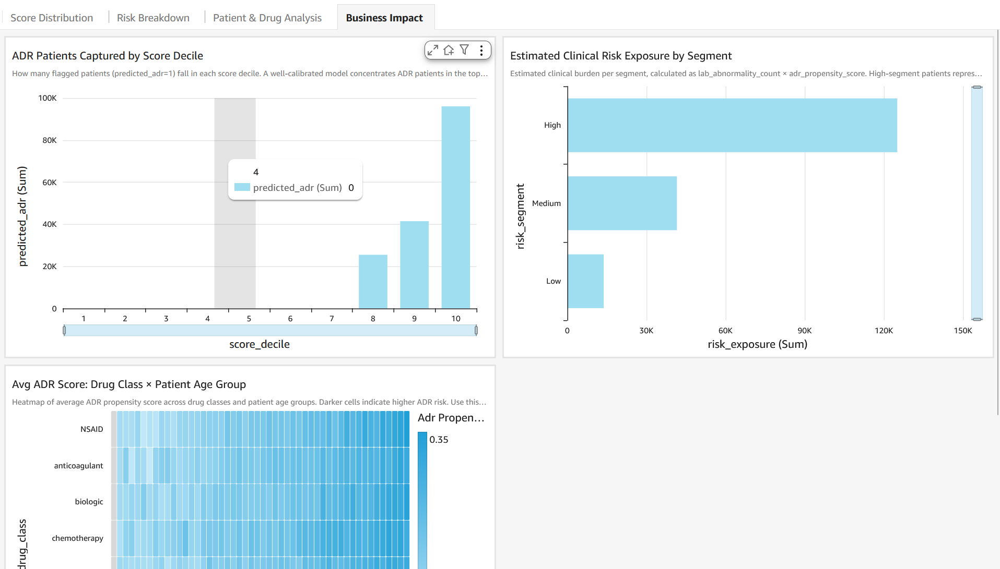
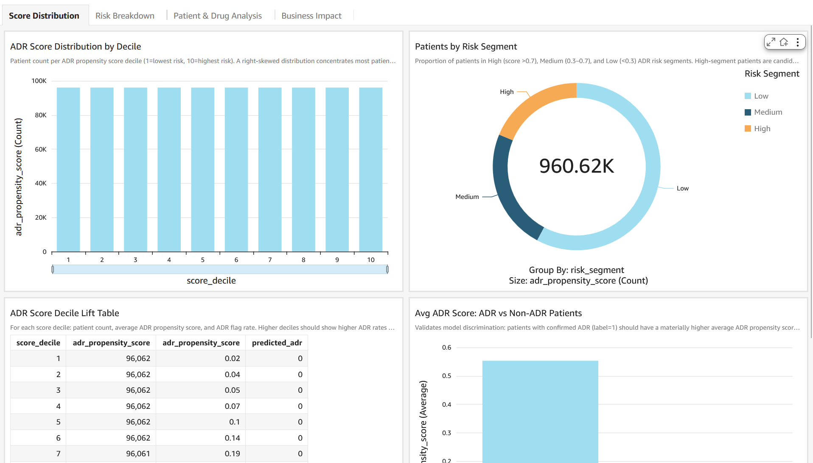
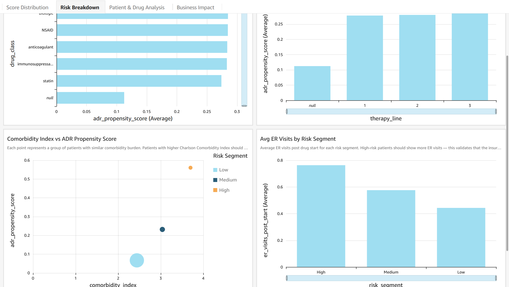

# Predict Patients Adverse Drug Reactions by Combining Pharma and Health Insurer Data using AWS Clean Rooms ML

[](https://opensource.org/licenses/MIT-0)

Self-contained demo showing how a **pharma company** and a **health insurer** can jointly score every shared patient for adverse drug reaction (ADR) risk — without either party ever exposing its raw data to the other.

The pharma company contributes **drug exposure and known risk signals** (dosage, treatment duration, therapy line, clinical trial safety scores, black box warnings, and NLP-extracted signals from spontaneous ADR report narratives) and the health insurer contributes **real-world outcomes signals** (ER visits, hospitalizations, lab abnormalities, drug discontinuation, and NLP-extracted signals from post-visit clinical notes and patient-clinician conversations). AWS Clean Rooms ML joins these datasets inside a secure collaboration, trains an ADR propensity model on the combined signal, and scores every patient — all without either party seeing the other's underlying records.

The output is a ranked list of patients by ADR propensity score, visualized in an Amazon QuickSight dashboard that shows which risk segments, drug classes, and signal combinations drive the highest ADR likelihood — enabling earlier safety interventions, proactive pharmacovigilance, and real-world evidence for regulatory submissions.

---

## Use Case: Cross-Party Adverse Drug Reaction Propensity Scoring

**Scenario:** A pharma company (Party A) and a health insurer (Party B) want to collaborate on predicting which patients are most likely to experience a serious adverse drug reaction, based on combined drug exposure and real-world outcomes signals. Neither party can share raw data due to regulatory constraints (HIPAA, GDPR, data use agreements, and commercial sensitivity).

**The core insight:** Pharma companies receive spontaneous ADR reports but capture only ~10% of serious adverse events — they are flying blind on real-world outcomes ([Uppsala Reports, WHO Collaborating Centre for International Drug Monitoring, 2024](https://uppsalareports.org/articles/underreporting-in-pharmacovigilance-where-do-we-go-from-here/)). The health insurer sees every ER visit, hospitalization, new diagnosis, and lab abnormality — but cannot determine which drug caused what without the pharma company's exposure and risk profile data. Neither party alone can build a reliable ADR signal. Combined, they can detect safety signals months earlier than traditional pharmacovigilance methods.

**Solution:** AWS Clean Rooms ML enables both parties to contribute their data to a secure collaboration. Clean Rooms joins the datasets on a shared key (`patient_id`), trains an ADR propensity model on the combined features, and runs inference — all without either party seeing the other's raw data.

**Business Value:** Earlier ADR detection prevents patient harm, reduces costly drug withdrawals and black-box warning additions, and satisfies post-market safety obligations mandated by the FDA (Sentinel Initiative) and EMA (EudraVigilance). Adverse drug events in hospitalized patients are estimated to cost an average of $5,000–$10,000 per event ([Shehab et al., Health Economics Review, 2024](https://healtheconomicsreview.biomedcentral.com/articles/10.1186/s13561-024-00481-y)), and post-marketing drug withdrawals due to ADRs have affected [462 medicinal products between 1953 and 2013](https://www.researchgate.net/publication/291947550_Post-marketing_withdrawal_of_462_medicinal_products_because_of_adverse_drug_reactions_A_systematic_review_of_the_world_literature), with hepatotoxicity as the most common cause.

---


## Pre-Processing: Unstructured Data Extraction

Both parties hold valuable information locked in unstructured text. Before contributing data to the Clean Rooms collaboration, each party runs an NLP pre-processing step using AWS services to extract structured features from their unstructured sources. **This pre-processing step is a prerequisite for the demo and is out of scope of the Clean Rooms ML workflow itself.**

### Party A — Pharma Company: Spontaneous ADR Report Narratives

The pharma company receives spontaneous adverse event reports (MedWatch / CIOMS forms) as free-text narratives from patients and physicians. These describe what happened, when, what the patient was taking, and what symptoms appeared.

**Tool:** [Amazon Comprehend Medical](https://aws.amazon.com/comprehend/medical/) — a HIPAA-eligible NLP service that extracts medical conditions, medications, dosages, symptoms, and temporal expressions from clinical text.

Structured features extracted from report narratives:
- `reported_symptom_count` — number of distinct symptom entities detected
- `symptom_severity_flag` — 1 if terms like "severe", "life-threatening", or "hospitalized" are detected
- `time_to_onset_days` — days from drug start to symptom onset, extracted from temporal expressions
- `concomitant_drug_count_reported` — number of other drugs mentioned in the report
- `prior_adr_narrative_flag` — 1 if prior reactions to this drug class are mentioned

### Party B — Health Insurer: Clinical Notes and Patient Conversations

The health insurer holds post-visit clinical notes, discharge summaries, and recordings of patient-clinician consultations. These contain real-world ADR signals that never make it into structured claims fields — a note saying "patient presented with elevated liver enzymes, currently on [drug X]" is a pharmacovigilance signal invisible to the pharma company.

**Tools:**
- [Amazon Comprehend Medical](https://aws.amazon.com/comprehend/medical/) — processes written clinical notes and discharge summaries to extract symptoms, diagnoses, medications, and lab findings with negation detection (distinguishing "no chest pain" from "chest pain")
- [AWS HealthScribe](https://aws.amazon.com/healthscribe/) — processes recorded patient-clinician conversations to extract chief complaints, structured medical terms, and assessment/plan sections

Structured features extracted from clinical notes and conversations:
- `symptom_mention_count` — symptom entities extracted from clinical notes
- `drug_symptom_co_mention` — 1 if the monitored drug and a symptom appear in the same note
- `negated_symptom_count` — symptoms explicitly negated (reduces false positives)
- `lab_abnormality_mentioned` — 1 if abnormal lab values are mentioned in note text
- `chief_complaint_adr_flag` — 1 if chief complaint (from HealthScribe) matches known ADR terms for this drug class

---

## Data Overview

The demo uses two synthetic datasets generated by `data/generate_synthetic_data.py`. The data simulates a realistic scenario where drug exposure signals from the pharma company and real-world outcome signals from the insurer are independently predictive but neither is sufficient alone.

### Population

| Metric | Value |
|--------|-------|
| Total unique patients | 50,000 |
| Shared patients (in both datasets) | 40,000 (80%) |
| Pharma-only patients | 5,000 (10%) |
| Insurer-only patients | 5,000 (10%) |
| Date range | Jan 1 – Jun 30, 2025 |

### Party A — Pharma Company: Drug Exposure & Risk Profile Data

**~101,000 rows** — each row represents one patient's exposure record for a specific drug.

| Column | Type | Source | Description |
|--------|------|--------|-------------|
| patient_id | string | structured | Unique patient identifier (join key) |
| drug_id | string | structured | Drug being monitored |
| drug_class | string | structured | Therapeutic class (e.g., biologic, NSAID, statin, chemotherapy) |
| dose_mg | float | structured | Prescribed daily dose in mg |
| treatment_duration_days | int | structured | Days on drug at observation date |
| therapy_line | int | structured | Line of therapy (1 = first-line, etc.) |
| known_risk_score | float | structured | Risk score derived from clinical trial safety data (0–1) |
| black_box_warning | int | structured | 1 if drug carries an FDA black box warning |
| patient_age | int | structured | Patient age at treatment start |
| indication_severity | float | structured | Severity of the underlying condition being treated (0–1) |
| reported_symptom_count | int | **Comprehend Medical** | Distinct symptoms extracted from spontaneous ADR report narratives |
| symptom_severity_flag | int | **Comprehend Medical** | 1 if severe/life-threatening terms detected in report text |
| time_to_onset_days | int | **Comprehend Medical** | Days from drug start to symptom onset (from report narrative) |
| concomitant_drug_count_reported | int | **Comprehend Medical** | Other drugs mentioned in spontaneous reports |
| prior_adr_narrative_flag | int | **Comprehend Medical** | 1 if prior reactions to this drug class mentioned in report text |
| observation_date | date | structured | Date of the observation record |

### Party B — Health Insurer: Real-World Outcomes & Claims Data

**~113,000 rows** — each row represents one patient's outcomes record for a specific drug.

| Column | Type | Source | Description |
|--------|------|--------|-------------|
| patient_id | string | structured | Unique patient identifier (join key) |
| drug_id | string | structured | Drug identifier |
| er_visits_post_start | int | structured | ER visits in the 90 days after drug start |
| hospitalizations_post_start | int | structured | Hospitalizations in the 90 days after drug start |
| days_to_first_er_visit | int | structured | Days from drug start to first ER visit (999 if none) |
| drug_discontinuation | int | structured | 1 if patient stopped the drug within observation window |
| days_to_discontinuation | int | structured | Days until discontinuation (999 if still on drug) |
| num_concomitant_meds | int | structured | Number of other drugs taken concurrently |
| high_risk_combo | int | structured | 1 if patient is on a known high-risk drug combination |
| lab_abnormality_count | int | structured | Number of out-of-range lab results in 90 days post-start |
| comorbidity_index | float | structured | Charlson Comorbidity Index score |
| prior_hospitalization | int | structured | 1 if hospitalized in 12 months before drug start |
| symptom_mention_count | int | **Comprehend Medical** | Symptom entities extracted from post-visit clinical notes |
| drug_symptom_co_mention | int | **Comprehend Medical** | 1 if monitored drug and a symptom co-occur in the same note |
| negated_symptom_count | int | **Comprehend Medical** | Symptoms explicitly negated in notes (reduces false positives) |
| lab_abnormality_mentioned | int | **Comprehend Medical** | 1 if abnormal lab values mentioned in note text |
| chief_complaint_adr_flag | int | **HealthScribe** | 1 if chief complaint matches known ADR terms for this drug class |
| has_adr | int | structured | Ground-truth label: 1 = confirmed ADR, 0 = no ADR |

---

---

## Feature Engineering

**Clean Rooms Mode:** When Clean Rooms ML runs training, it joins the two tables on `patient_id` and sends a single pre-joined, headerless CSV to the training container. The `patient_id` column is excluded (it's the join key). The training script detects this format and applies column names automatically.

### Features Used (Clean Rooms Mode)

| Feature | Source | Description |
|---------|--------|-------------|
| dose_mg | Pharma company | Prescribed daily dose |
| treatment_duration_days | Pharma company | Days on drug |
| therapy_line | Pharma company | Line of therapy |
| known_risk_score | Pharma company | Clinical trial safety risk score (0–1) |
| black_box_warning | Pharma company | 1 if FDA black box warning |
| patient_age | Pharma company | Patient age at treatment start |
| indication_severity | Pharma company | Severity of underlying condition (0–1) |
| reported_symptom_count | Pharma company / Comprehend Medical | Symptoms from spontaneous reports |
| symptom_severity_flag | Pharma company / Comprehend Medical | 1 if severe terms in report |
| time_to_onset_days | Pharma company / Comprehend Medical | Days to symptom onset from report |
| concomitant_drug_count_reported | Pharma company / Comprehend Medical | Other drugs in spontaneous reports |
| prior_adr_narrative_flag | Pharma company / Comprehend Medical | 1 if prior reactions mentioned |
| er_visits_post_start | Health insurer | ER visits post drug start |
| hospitalizations_post_start | Health insurer | Hospitalizations post drug start |
| days_to_first_er_visit | Health insurer | Days to first ER visit |
| drug_discontinuation | Health insurer | 1 if drug stopped |
| days_to_discontinuation | Health insurer | Days until discontinuation |
| num_concomitant_meds | Health insurer | Concurrent medications |
| high_risk_combo | Health insurer | 1 if high-risk drug combination |
| lab_abnormality_count | Health insurer | Out-of-range lab results |
| comorbidity_index | Health insurer | Charlson Comorbidity Index |
| prior_hospitalization | Health insurer | 1 if hospitalized before drug start |
| symptom_mention_count | Health insurer / Comprehend Medical | Symptoms in clinical notes |
| drug_symptom_co_mention | Health insurer / Comprehend Medical | 1 if drug + symptom co-occur in note |
| negated_symptom_count | Health insurer / Comprehend Medical | Negated symptoms in notes |
| lab_abnormality_mentioned | Health insurer / Comprehend Medical | 1 if abnormal labs in note text |
| chief_complaint_adr_flag | Health insurer / HealthScribe | 1 if chief complaint matches ADR terms |
| dose_duration_interaction | Derived | dose_mg × treatment_duration_days / 1000 |
| comorbidity_drug_burden | Derived | comorbidity_index × num_concomitant_meds |

**Target variable:** `has_adr` (1 = confirmed ADR, 0 = no ADR)

---

## Analysis & Model Training

### Model Architecture

| Parameter | Value |
|-----------|-------|
| Algorithm | Gradient Boosting Classifier (sklearn) |
| Train/Test Split | 80% / 20%, stratified by target |
| n_estimators | 100 |
| max_depth | 5 |
| learning_rate | 0.1 |
| Random seed | 42 |

### Training Flow in Clean Rooms ML

1. Clean Rooms joins the pharma company and health insurer tables on `patient_id` inside the collaboration
2. The pre-joined data (headerless CSV, no `patient_id` column) is sent to the training container
3. The training script detects the headerless format and applies column names
4. Derived features (`dose_duration_interaction`, `comorbidity_drug_burden`) are computed
5. GradientBoostingClassifier is trained on the 29 features with `has_adr` as target
6. Model artifacts (`model.joblib`, `feature_columns.json`) are saved to `/opt/ml/model`
7. Metrics (accuracy, precision, recall, F1, ROC-AUC) are saved to `/opt/ml/output/data`

### Inference Flow in Clean Rooms ML

1. Clean Rooms sends the same pre-joined data to the inference container
2. The inference handler loads the trained model and feature column list
3. Derived features are computed on the fly (same as training)
4. Model predicts `adr_propensity_score` (0–1) and `predicted_adr` (0/1) for each record
5. Results are written as CSV to the configured output S3 bucket

---

## Results

### Output Format

| Column | Type | Description |
|--------|------|-------------|
| adr_propensity_score | float (0–1) | Predicted probability of adverse drug reaction |
| predicted_adr | int (0/1) | Binary prediction: 1 = likely ADR |

### Interpreting the Results

- `adr_propensity_score > 0.25` → predicted as likely ADR (`predicted_adr = 1`)
- Risk segments: High (score > 0.35), Medium (0.15–0.35), Low (< 0.15) — thresholds calibrated to the actual score distribution
- Higher scores indicate stronger combined signals from drug exposure profile and real-world outcomes
- The pharma company can use these scores to prioritize patients for enhanced safety monitoring and proactive outreach
- The health insurer can flag high-risk patients for clinical review before a serious event occurs

### Key Metrics (from training evaluation)

| Metric | Both Parties (Clean Rooms) | Pharma Only | Insurer Only |
|--------|---------------------------|-------------|--------------|
| Accuracy | ~83% | ~78% | ~78% |
| Precision | ~73% | ~64% | ~63% |
| Recall | ~47% | ~25% | ~32% |
| F1 Score | ~0.57 | ~0.36 | ~0.43 |
| ROC-AUC | ~0.87 | ~0.77 | ~0.80 |

### Collaboration Value

- Combining data from both parties yields a **~10-point ROC-AUC improvement** over either party alone
- F1 score nearly doubles compared to pharma-only predictions
- Feature importance is distributed across both pharma and insurer features, with NLP-extracted signals from both sides contributing meaningfully — no single feature exceeds ~12% importance

### Dashboard Screenshots

**Score Distribution** — ADR score histogram by decile, risk segment donut, lift table, ADR vs non-ADR comparison



**Risk Breakdown** — avg ADR score by drug class and therapy line, comorbidity scatter, ER visits by segment



**Business Impact** — ADR patients captured by decile, clinical risk exposure by segment, drug class × age heatmap



---

### Prerequisites

- Python 3.10+ with `boto3`, `pandas`, `scikit-learn`, `joblib` installed
- AWS CLI configured with valid credentials
- AWS account with Clean Rooms ML access enabled

> **NLP Pre-processing (out of scope for this demo):** In a real deployment, the pharma company would run spontaneous ADR report narratives through [Amazon Comprehend Medical](https://aws.amazon.com/comprehend/medical/) and the health insurer would run clinical notes through Amazon Comprehend Medical and patient-clinician conversation recordings through [AWS HealthScribe](https://aws.amazon.com/healthscribe/) before contributing data to the collaboration. The synthetic data generator simulates the structured output of this pre-processing step.

> **Optional — QuickSight Dashboard (Step 6):** Set `QS_NOTIFICATION_EMAIL` in `config.py` to a valid email address. Your `AWS_REGION` must support QuickSight, Athena, Glue, and S3 in the same region.

### Step 0: Configure Your Account

Edit `config.py` and set your values:

```python
AWS_ACCOUNT_ID        = "123456789012"   # Your 12-digit AWS account ID
AWS_REGION            = "us-east-1"      # Your preferred region
QS_NOTIFICATION_EMAIL = "your@email.com" # Optional: only needed for Step 6 (QuickSight)
```

### Step 1: Generate Synthetic Data

```bash
python data/generate_synthetic_data.py
```

### Step 2: Upload Data to S3

```bash
python scripts/upload_data.py
```

### Step 3: Build & Push Docker Containers

**Option A — via CodeBuild:**
```bash
python scripts/codebuild_containers.py
```

**Option B — via local Docker:**
```bash
python scripts/build_and_push.py
```

### Step 4: Set Up Clean Rooms Infrastructure

```bash
python scripts/setup_cleanrooms.py
```

### Step 5: Train Model & Run Inference

```bash
python scripts/run_cleanrooms_ml.py
```

### Step 6: Create QuickSight Dashboard

```bash
python scripts/create_dashboard.py
```

The dashboard covers:
- ADR score distribution by decile and risk segment
- ADR risk by drug class and therapy line
- Top contributing features (pharma vs insurer signal breakdown)
- High-risk patient list with score and key drivers
- Collaboration value: single-party vs combined model performance comparison

---

## Project Structure

```
config.py                          ← SET YOUR ACCOUNT + REGION HERE
README.md                         ← This file
buildspec.yml                     ← CodeBuild spec
data/
  generate_synthetic_data.py      ← Generates synthetic pharma company + health insurer CSVs
containers/
  training/
    Dockerfile                    ← Parameterized base image via ARG
    train.py                      ← GradientBoosting training script (ADR detection)
  inference/
    Dockerfile                    ← Parameterized base image via ARG
    serve.py                      ← HTTP server (/ping + /invocations)
    inference_handler.py          ← Model loading + prediction logic
scripts/
  upload_data.py                  ← Upload CSVs to S3 + create buckets
  codebuild_containers.py         ← Build containers via CodeBuild (no local Docker)
  build_and_push.py               ← Build containers via local Docker
  setup_cleanrooms.py             ← Create Glue, IAM, collaboration, ML config
  run_cleanrooms_ml.py            ← Create channels, train model, run inference
  create_dashboard.py             ← Optional: create QuickSight dashboard (Step 6)
  test_training_local.py          ← Test training locally (no AWS needed)
  sagemaker_training_job.py       ← Optional: run training via SageMaker directly
```

---

## License

This library is licensed under the MIT-0 License.
